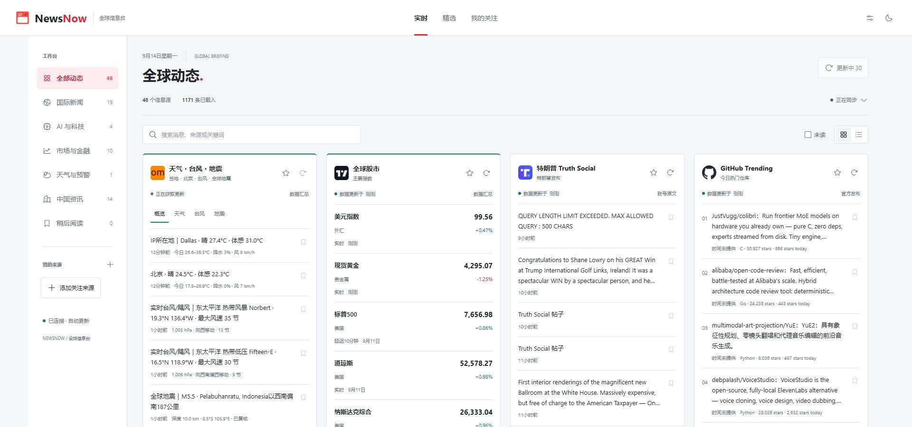
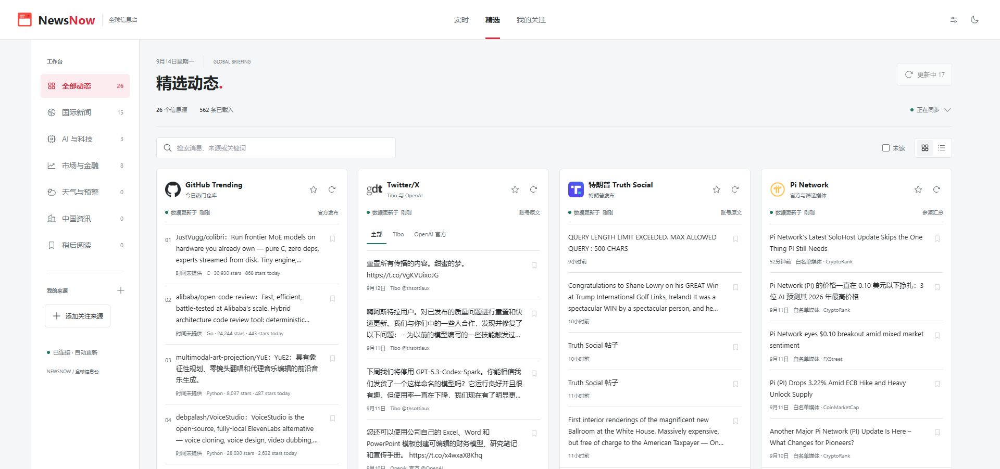

# NewsNow





[English](./README.md) | 简体中文 | [日本語](README.ja-JP.md) · [在线实例](https://newsnow-1nq.pages.dev/c/realtime)

***快速、清晰地阅读全球新闻和实时信息***

> [!NOTE]
> NewsNow 是可自行部署的新闻聚合项目。当前以中文阅读为主，英文来源会翻译为中文，同时保留原始媒体链接。

## 功能特性
- 按来源设置刷新频率，支持快速刷新、最近一次成功快照回退和手动获取最新内容
- 中文优先的阅读体验，英文标题自动翻译并保留原文链接
- 当前包含 48 个有效来源接口，覆盖新闻、股市、天气、科技、社交信息和公共机构
- 支持 GitHub OAuth 登录，可选同步跨设备偏好设置
- “最热”优先采用有明确编辑责任的媒体、通讯社、官方发布和公共广播

## 默认新闻源策略
- 优先保留通讯社、官方原始发布、公共国际广播和有明确编辑责任的新闻机构
- 默认移除社交热搜、短视频热榜、论坛热帖、社区趋势榜和明显的二手搬运源
- 目标是减少谣言、情绪化排序和未经核实的转述，让信息尽可能接近真实事件本身

## 当前内容范围

- **全球股市：** 美国、中国、日本、韩国主要指数，以及美元指数和黄金
- **天气与事件：** 根据 IP 估算的当地天气、北京天气、实时台风和近期全球地震
- **美国与科技：** 特朗普 Truth Social、Tibo 与 OpenAI 的 X 信息、美国 AI、GitHub Trending、Apple News/Podcasts
- **财经与央行：** Pi Network、美联储、路透社、美联社、法新社、彭博社、金融时报、华尔街日报和日经亚洲
- **国际新闻：** BBC News、BBC World Service、德国之声、France 24、NHK World、经济学人、法广和联合国新闻
- **中国相关：** 中国政府网、人民网、中国新闻网、新华社英文和南华早报

来源是否可用取决于发布方及其公开接口。上游暂时不可用时，NewsNow 会保留最近一次成功快照并标记刷新状态，不会把旧内容伪装成最新消息。翻译由机器辅助完成，不代表发布方的正式译文。

## 部署指南

### 基础部署
无需登录和缓存功能时，可直接部署至 Cloudflare Pages 或 Vercel：
1. Fork 本仓库
2. 导入至目标平台

### Cloudflare Pages 配置
- 构建命令：`pnpm run build`
- 输出目录：`dist/output/public`

### GitHub OAuth 配置
1. [创建 GitHub App](https://github.com/settings/applications/new)
2. 无需特殊权限
3. 回调 URL 设置为：`https://your-domain.com/api/oauth/github`（替换 your-domain 为实际域名）
4. 获取 Client ID 和 Client Secret

### 环境变量配置
参考 `example.env.server` 文件，本地运行时重命名为 `.env.server` 并填写以下配置：

```env
# GitHub Client ID
G_CLIENT_ID=
# GitHub Client Secret
G_CLIENT_SECRET=
# JWT Secret，通常就用 Client Secret
JWT_SECRET=
# 初始化数据库, 首次运行必须设置为 true，之后可以将其关闭
INIT_TABLE=true
# 是否启用缓存
ENABLE_CACHE=true
```

### 数据库支持
本项目主推 Cloudflare Pages 以及 Docker 部署， Vercel 需要你自行搞定数据库，其他支持的数据库可以查看 https://db0.unjs.io/connectors 。

1. 在 Cloudflare Worker 控制面板创建 D1 数据库
2. 在 `wrangler.toml` 中配置 `database_id` 和 `database_name`
3. 若无 `wrangler.toml` ，可将 `example.wrangler.toml` 重命名并修改配置
4. 重新部署生效

### Docker 部署
对于 Docker 部署，只需要项目根目录 `docker-compose.yaml` 文件，同一目录下执行
```
docker compose up
```
同样可以通过 `docker-compose.yaml` 配置环境变量。

## 开发
> [!Note]
> 需要 Node.js >= 20

```bash
corepack enable
pnpm i
pnpm dev
```

如需添加数据源，请在 `shared/pre-sources.ts` 注册元数据，在 `server/sources/` 实现获取逻辑，并在 `test/` 增加解析测试。上游提供时，应保留原始媒体链接和发布时间。

### 验证

```bash
pnpm test
pnpm typecheck
pnpm build
```

## 数据源与使用说明

- NewsNow 是聚合工具，不是新闻发布方或事实核查机构。
- 媒体名称、标识、文章内容和数据接口归各自权利人所有，并受其条款约束。
- 来源可能延迟、限流、被屏蔽或暂时不可用，任何接口都不能保证完整或始终无误。
- 投资、应急、医疗、法律等高风险场景，请务必核对原始来源，不要只依据本项目内容。

## 贡献指南
欢迎贡献代码！您可以提交 pull request 或创建 issue 来提出功能请求和报告 bug

## License

[MIT](./LICENSE)。本项目基于 [ourongxing/newsnow](https://github.com/ourongxing/newsnow/)，上游作者和当前维护者的版权信息见 `LICENSE`。
